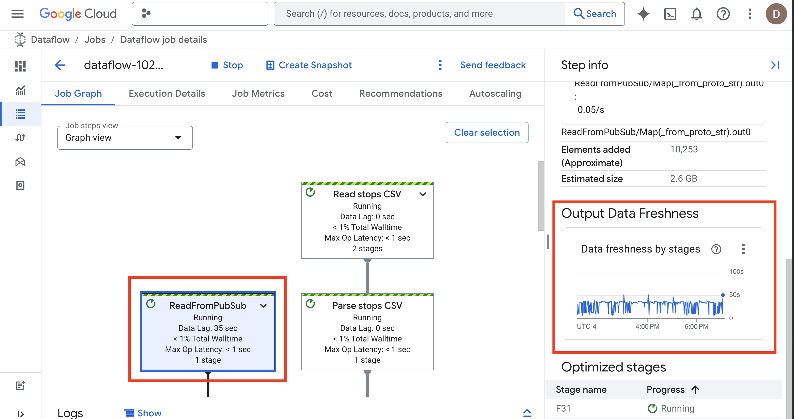
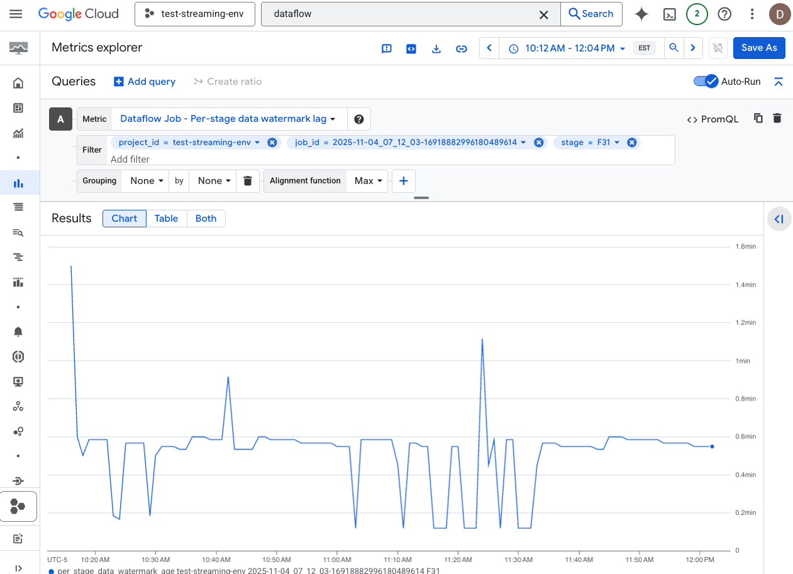

# Streaming Data Pipelines
<br><font size="5">
Production grade data pipelines capable of processing event streams in real time or near real time.
<br><br>

This implementation is connected to the [MTA real-time data feed](https://api.mta.info/#/subwayRealTimeFeeds) for the New York City subway system.  There are 8 separate feeds available, where this project is connected to a single feed, which is the ACE subway line.  The entire system can be observed on the [subway diagram](https://www.mta.info/map/5256).<br>  <br>The subway system is the largest in the world, with approximately 3.5 million daily riders, accessing subways through 470 stations, operating 24/7.  The ACE line will travel through approximately 100 of these stations and produce 1,200 unique daily trips on a weekday or 750 unique daily trips on weekends.<br>

The MTA claims the feed is updated with each subway vehicle timestamp every 30 seconds.  However, we found the updates are produced from 5 - 25 seconds.
We are polling the subway feed every 20 seconds, processing 3 messages per minute.  We are getting roughly 50 - 60 updates per message, so about 150 - 180 updates per minute. The feed produces nearly 1.25gb of data every 24 hrs with roughly 250,000 updates per 24 hrs on a weekday and about 130,000 updates on a weekend.
<br>

# Video Tutorial
I will launch a video tutorial sometime soon to walk through the project.

 <br>
<br>
The architecture uses the following GCP services:<br>
- Artifact Registry: Universal Package Manager<br>
We will containerize two applications and push them to the artifact registry.  The first application is the event processor, which fetches messages from the MTA endpoint.  The second application is the task queue, which sends triggers to the event processor every 20 seconds to fetch messages.<br>

- Cloud Run: Serverless Application Execution<br>
The event processor and task queue will be deployed for serverless execution on Cloud Run.
<br>
- Cloud Tasks: Queue Management<br>
Provides granular control over task distribution and execution timing.  The task queue sends a `POST` message to the event processor every 20 seconds to fetch messages.
<br>

- Cloud Scheduler: Cron Jobs (Event Triggers)<br>
Cloud scheduler will initiate triggers to Cloud Tasks every minute.  Since Cloud Scheduler does not allow for sub-minute triggers, we use Cloud Tasks to distribute more granular triggers within each minute.
<br>

- Pub/Sub: Message Broker<br>
Enterprise messaging bus provided by Google. We decouple the event feed from the data processing application as an architecture best practice.  Messages will be published to a topic, with Dataflow as the consumer pulling messages from the topic.
<br>
- Dataflow: Data Processing Engine<br>
Dataflow provides a data processing pipeline specifically built for streaming data.
The pipeline will include 4 transformation, to flatten, filter, enrich and apply windowing to our dataset before we write to BigQuery.<br>

- BigQuery: Data Warehouse<br>
Once the data is processed, it will be written to BigQuery.  The data watermark lag is between 7 - 35 seconds.  Writing to SQL accounts for most of the latency.  For faster read/write, where lower latency is a requirement, BigTable can be plugged in as an alternative data sink.
</font>
<br>

<font size="5">

# Implementation Steps
Most implementation is automated through Terraform

# Quick Start 
Deploy the entire pipeline with a single command! 

## Prerequisites
- Google Cloud Project with billing enabled
- Owner or Editor permissions
- Cloud Shell or `gcloud` CLI installed

## One-Command Deployment

**Step 1:** Open [Google Cloud Shell](https://shell.cloud.google.com/) 

**Step 2:** Clone the repository
```shell
git clone https://github.com/DanHerman212/streaming-systems.git
cd streaming-systems
```

**Step 3:** Run the deployment script
```shell
chmod +x deploy.sh
./deploy.sh YOUR_PROJECT_ID us-east1
```
</font>

## **That's it!**<br>
### Here is what happens once you run the script:
<font size="5">
1.  The script will first build a container registry, then containerize and push to the registry.<br><br>
2.  Terraform provides IaC (Infrastructure as Code).  All services, service accounts and permissions will be deployed in roughly 1 minute.<br><br>
3.  Once all infrastructure is deployed, the Dataflow pipeline will be launched<br><br>
4.  Once all services are deployed, you'll receive a message with links on where to check status of deployment.<br><br>
5.  You may see cloud scheduler in a "failed" state, with some errors in the logs for cloud run.  This is normal, due to permission propagation.  Ignore these errors, as the permissions propagate in the background, it will self-correct.<br><br>
6.  The "valve" for the data feed is cloud scheduler.  If you ever need to pause the data feed, just go to scheduler in the gcp console and pause the triggers.
<br><br>
7. To remove the infrastructure, go to the `4-terraform` folder and run `terraform destroy`.  You will have to manually delete container registry and the dataset in BigQuery.
</font>

# Dataflow Dashboard
It will take 3 minutes for Dataflow to get up and running.  You can check the data watermark lag on the first step of the pipeline.  That's the primary performance metric you should be concerned about.
<br>


<bR><br>
You can click the three small dots and expand the dashboard for better visibility.



# Data Dictionary
Data definition can be found at [data dictionary page](data.md)<br>

# SQL Anlaysis and Data Visualization
As a frequent passenger of the ACE subway line, I answered a few common questions I was curious about:<br>
- What is the average time between train arrivals on the ACE line during a weekday?<br>
- What are the top 10 busiest stations on the ACE line?<br>
- What is the average idle time per station on the ACE line?<br><br>
Queries can be found in the [sql folder](/5-sql) folder.<br>
Make sure to update your project-id in the queries before executing.

## Avg Time Between Trains and Frequency
The range of time waiting for a train can be less than 2 minutes to over 16 minutes.  There is a clear correlation between busy stations and wait times.  Busier stations are served with <2 minute wait times.  <br>  The top 5 stations can be observed in the lower right quadrant.  The next insight will identify those stations.


<br>

# Top 10 Busiest Stations
These are the busiest stations for the ACE line, based on total number of train arrivals in a 24 hour weekday period.

Fun Fact: [42-St Port Authority Terminal](https://www.mta.info/agency/new-york-city-transit/subway-bus-ridership-2024) (Times Square) has the most riders with 58 million paid passengers in 2024.

# Idle Time Per Station

The map represents the geographic footprint of all stations and average idle time per station.  Most stations show less than 30 second idle time, for the ACE line.


---
# Folder Structure
```
├── 1-dataflow # data processing pipeline script
│   ├── dataflow.py
│   └── replace_project_id.sh
├── 2-event-processor # fetches messages from MTA event feed
│   ├── Dockerfile
│   ├── app.py
│   └── requirements.txt
├── 3-task-queue # sends triggers to event processor every 20 seconds
│   ├── Dockerfile
│   ├── main.py
│   └── requirements.txt
├── 4-terraform # infrastructure as code - automates deployment in 1 minute
│   ├── main.tf
│   ├── modules
│   │   ├── apis
│   │   ├── cloud_run
│   │   ├── cloud_tasks
│   │   ├── pubsub
│   │   ├── scheduler
│   │   ├── service_accounts
│   │   └── storage
│   ├── outputs.tf
│   ├── sample.tfvars
│   ├── schema.json
│   └── variables.tf
├── 5-sql # sql analysis scripts and ml dataset creation
│   ├── avg_idle_time_by_station.sql
│   ├── avg_time_between_trains.sql
│   ├── create_ml_dataset_5stops_tables.sql
│   ├── create_train_val_test_splits.sql
│   └── create_training_samples.sql
├── 6-images # for presentation purposes
│   ├── 0.5 Architecture.png
│   ├── 1206.png
│   ├── architecture2.png
│   ├── avg-time-bet-trains.png
│   ├── avg_time_bet_trains1.png
│   ├── barplot.png
│   ├── dataflow.png
│   ├── idle.png
│   ├── image.png
│   ├── scheduler.png
│   ├── shell.png
│   └── tf.png
├── 7-data-archive-tools # tools to extract data from subway archive
│   ├── delete_trips_files.py
│   ├── download_historical_data.py
│   └── load_to_bigquery.py
├── build_images.sh # builds and pushes container images to artifact registry
├── data.md # data dictionary
├── deploy.sh # primary deployment script
├── load_from_bigquery.py # loads data from bigquery for analysis
├── load_stops_to_bigquery.py # loads static subway stop info to bigquery
├── readme.md # this file
└── schema_historical_sensor_data.json # bigquery schema for historical data
``` 
</font>