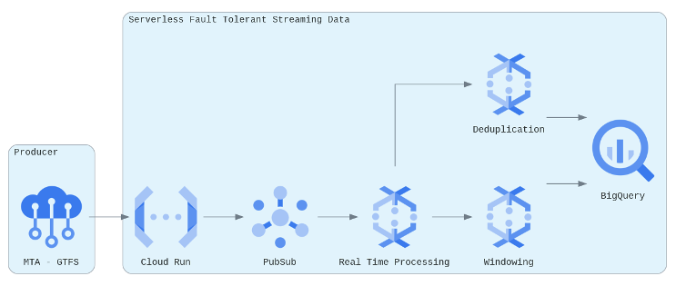

# Stream Processing Systems
Production grade data pipelines capable of processing event streams in real time or near real time.  
 
For this particular implementation, the architecture is setup on GCP and is completely serverless.  The design is modular with a primary goal to provide a real time data warehouse, delivering data between 7 - 35 seconds after it's created (dependant on event stream).  The warehouse can be swapped for a nosql database such as BigTable, to support lower latency i/o for real time applications. 
 
  
 
The architecture uses the following GCP services: 
- Artifact Registry: Universal Package Manager 
- Cloud Run: Serverless Application Execution 
- Cloud Tasks: Queue Management 
- Cloud Scheduler: Cron Jobs (Event Triggers)  
- Pub/Sub: Message Broker 
- Dataflow: Stream Processing Engine 
- BigQuery: Data Warehouse

